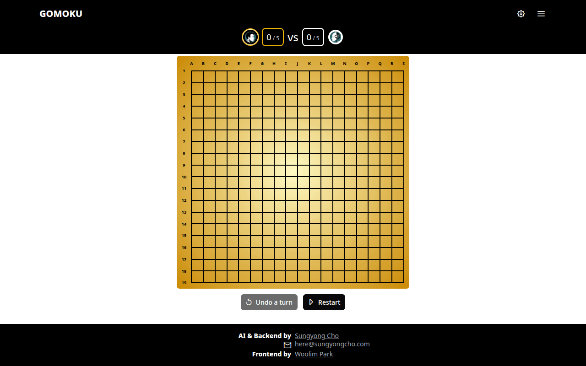

# Gomoku

A full-stack Gomoku (five-in-a-row) game featuring two AI engines built from scratch: a **C++ Minimax** engine (alpha-beta + PVS, depth 10) and a **Python AlphaZero** engine (self-play reinforcement learning with MCTS + ResNet).

**[Play live](https://sungyongcho.com/gomoku)** | **[Documentation](https://sungyongcho.com/gomoku/docs/about-gomoku/intro)**



## Stack

| Layer | Tech |
|---|---|
| Frontend | Nuxt 3, Vue 3, TypeScript |
| Minimax engine | C++, libwebsockets, Zobrist hashing, PVS with transposition table |
| AlphaZero engine | Python, PyTorch, MCTS (C++ native extension), ONNX inference |
| Training infra | Ray cluster on GCP, self-play + arena evaluation pipeline |
| Deployment | GCP Compute Engine, Cloudflare Workers reverse proxy |

## Local Development

Requires Docker and Docker Compose v2+.

```bash
git clone git@github.com:sungyongcho/gomoku.git
cd gomoku
cp .env.example .env
source alias.sh

# full stack (frontend + minimax + alphazero)
dev-up

# frontend + minimax only (no AlphaZero)
docker compose -f docker-compose.yml up front minimax
```

Open `http://localhost:${LOCAL_FRONT}/gomoku` (default port: `3000`).

Local documentation: `http://localhost:${LOCAL_FRONT}/gomoku/docs/about-gomoku/intro`

See `.env.example` for all configurable ports and variables.

## Project Structure

- **`alias.sh`** — Docker Compose shortcuts (`dev-up`, `dev-down`, `dev-up-debug`, etc.)
- **`Makefile`** — Original École 42 project submission entry point (front + minimax only)
- **`front/`** — Nuxt 3 frontend with interactive documentation and diagrams
- **`minimax/`** — C++ minimax engine (WebSocket server)
- **`alphazero/`** — AlphaZero training pipeline, inference server, and C++ MCTS extension

## Third-Party Code

- Double-three detection uses logic derived from the [Renju open source reference implementation](https://www.renju.se/renlib/opensrc/). Refer to the upstream page for license details and attribution.
